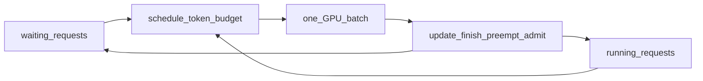

# 00 — Mental Model: Why Fast Inference Is Hard

If you only remember one chapter, remember this one. Every major abstraction in vLLM
exists to attack a small set of bottlenecks that appear the moment you try to serve
many autoregressive sequences on a GPU.

## The naive baseline (and why it fails)

**Static batching:** wait until you have N prompts, pad them to the same length, run
prefill together, then decode together until the longest sequence finishes.

Problems:

1. **GPU idle time.** Short sequences finish early; the batch still waits for the long
   one. Decode is memory-bandwidth bound and loves large batches—but static batches
   shrink as sequences complete.
2. **Latency vs throughput conflict.** Large static batches raise throughput and destroy
   TTFT (time to first token) for the request that arrived first.
3. **KV memory waste.** Allocating a contiguous KV buffer of `max_seq_len` per request
   fragments HBM and caps concurrency long before FLOPs are saturated.

## Three bottlenecks vLLM is built around

| Bottleneck | Symptom | Systems response |
|------------|---------|------------------|
| **Batch composition** | GPU underutilized; prefills block decodes or vice versa | **Continuous batching** — admit/finish requests every step |
| **KV memory layout** | OOM or low concurrency despite free HBM | **Paged KV cache** — fixed-size blocks, non-contiguous sequences |
| **CPU critical path** | GPU waits on Python/scheduler/tokenization | **Process split** — API/tokenize off the EngineCore/GPU loop |

Everything else (prefix caching, chunked prefill, CUDA graphs, attention backends) is an
optimization layered on these three.

## Continuous batching (intuition)

At every engine step the system:

1. Decides *how many tokens* each active request may compute this step
2. Builds one GPU batch from that plan
3. Runs the model
4. Appends sampled tokens, frees finished requests, admits waiting ones

There is no sealed “prefill phase” then “decode phase” at the system level. A request
that still has prompt tokens left and a request that only needs one new decode token can
share the same step. V1 makes this explicit: the schedule is a map
`{request_id: num_tokens}` under a global token budget (`max_num_batched_tokens`).

**Trade-off:** maximum flexibility increases scheduler CPU work and metadata complexity.
V1's design goal is *near-zero CPU overhead* on that path—see the engine chapter.

## Paged attention / paged KV (intuition)

OS analogy: processes get virtual pages; physical frames are non-contiguous. vLLM does
the same for KV:

- Split each sequence's K/V into **blocks** of `block_size` tokens
- Maintain a **block table** (virtual → physical)
- Attention kernels gather K/V through that table

This attacks fragmentation and enables sharing (prefix caching): two requests with the
same prompt prefix can reference the same physical blocks.

**Trade-off:** indirection costs in kernels; block size is a compromise between
internal fragmentation and table/metadata overhead.

> **Historical note:** The original PagedAttention paper kernels are *not* what you
> debug day-to-day. Production paths go through FlashAttention (and friends) with paged
> KV layouts. Treat [docs/design/paged_attention.md](../docs/design/paged_attention.md)
> as history, not a map of `vllm/v1/attention/`.

## Historical arc (what to learn from it)

1. **SOSP'23 PagedAttention paper** — proved paging + continuous batching for LLM serving.
2. **vLLM V0** — shipped the idea; features accreted (chunked prefill, APC, spec decode)
   as somewhat separate codepaths → complexity and technical debt.
3. **vLLM V1** — re-architected scheduler, KV manager, worker, sampler, API server into
   one unified loop. Same kernels/models where possible; different control plane.
   See [docs/usage/v1_guide.md](../docs/usage/v1_guide.md) and the
   [V1 blog](https://blog.vllm.ai/2025/01/27/v1-alpha-release.html).

When reading old blog posts or issues, check whether they describe V0 or V1.

## Trade-off table (keep this handy)

| Knob / choice | Push toward throughput | Push toward latency / simplicity |
|---------------|------------------------|----------------------------------|
| Larger batches / higher `max_num_batched_tokens` | Better GPU util | Worse TTFT / longer schedule |
| Higher `gpu_memory_utilization` | More KV → more concurrency | Risk of OOM with graphs/fragmentation |
| Chunked prefill | Smooths long prompts into the batch | More steps to first full prefill |
| Prefix caching (APC) | Huge wins on shared prefixes | Hashing complexity; wrong hits are catastrophic |
| CUDA graphs | Lower kernel launch overhead | Capture memory; shape constraints |
| Preemption | Survives KV pressure | Wastes compute on recompute |

## What “done” looks like for this chapter

You can explain, without code:

- Why static batching leaves the GPU idle
- Why contiguous KV allocation kills concurrency
- Why V1's schedule is “tokens per request” not “phases”
- Why paging enables both packing *and* prefix sharing

Next: [01-request-lifecycle.md](01-request-lifecycle.md).
