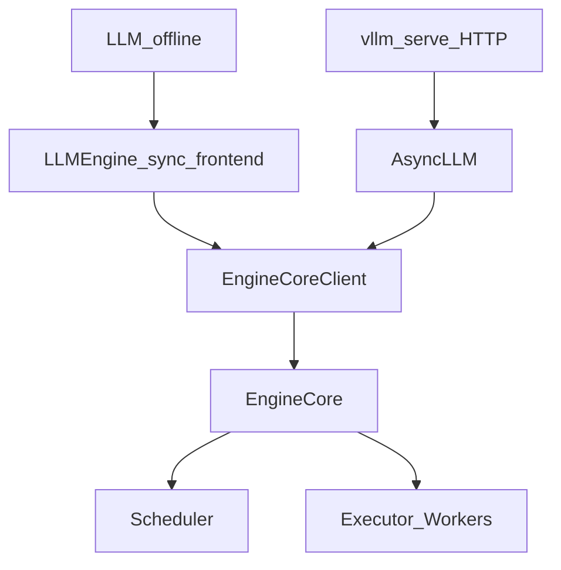

# 01 — Request Lifecycle

This chapter names the objects that cross process and module boundaries, then walks
API → tokens at a high level. Annotated traces live in [`traces/`](traces/).

## The type pipeline (memorize these)

| Stage | Type | Where defined | Role |
|-------|------|---------------|------|
| API / user | prompts + `SamplingParams` | `vllm/sampling_params.py` | User intent |
| After tokenize | `EngineCoreRequest` | `vllm/v1/engine/__init__.py` | Wire format into EngineCore |
| In scheduler | `Request` | `vllm/v1/request.py` | Mutable scheduling state |
| Schedule result | `SchedulerOutput` | `vllm/v1/core/sched/output.py` | Batch plan for the worker |
| After forward/sample | `ModelRunnerOutput` | `vllm/v1/outputs.py` | Token IDs, logprobs, etc. |
| Back to frontend | `EngineCoreOutput(s)` | `vllm/v1/engine/__init__.py` | Per-request deltas |
| User-facing | `RequestOutput` | `vllm/outputs.py` | Text / streaming chunks |

If you get lost in a stack trace, ask: *which of these types am I holding?*

## Two frontends, one core

- **Offline:** [`vllm/entrypoints/llm.py`](../vllm/entrypoints/llm.py) →
  [`vllm/v1/engine/llm_engine.py`](../vllm/v1/engine/llm_engine.py)
- **Online:** [`vllm/entrypoints/openai/api_server.py`](../vllm/entrypoints/openai/api_server.py)
  → [`vllm/v1/engine/async_llm.py`](../vllm/v1/engine/async_llm.py)

Both eventually call into `EngineCore` ([`vllm/v1/engine/core.py`](../vllm/v1/engine/core.py)).
Legacy modules `vllm/engine/llm_engine.py` and `async_llm_engine.py` are thin aliases to V1.

## Lifecycle in one picture

See also [diagrams/request-flow.mmd.md](diagrams/request-flow.mmd.md).

1. **Admit:** tokenize / validate → `EngineCoreRequest` → `Request` on `scheduler.waiting`
2. **Schedule:** allocate KV blocks (or prefix hit) → `SchedulerOutput`
3. **Execute:** worker prepares tensors → model forward (attention uses paged KV) → sample
4. **Update:** append tokens, stop checks, free KV → `EngineCoreOutputs`
5. **Emit:** detokenize / stream → `RequestOutput`

Steps 2–4 repeat every engine step until the request finishes or aborts.

## Why these boundaries exist

| Boundary | Bottleneck solved | Trade-off |
|----------|-------------------|-----------|
| InputProcessor in API process | Keep tokenization/IO off GPU loop | Extra serialization (msgpack/ZMQ) |
| `EngineCoreRequest` vs `Request` | Stable wire format vs rich scheduler state | Duplication of fields |
| `SchedulerOutput` | Scheduler must not touch GPU tensors | Worker must rebuild GPU metadata each step |
| OutputProcessor in API process | Detokenize/stream without blocking EngineCore | Another hop before the client sees text |

## Key fields on `Request` (scheduler mental model)

You will see these repeatedly in `Scheduler.schedule`:

- `num_computed_tokens` — how far KV/computation has progressed
- Prompt length + output token IDs (+ speculative tokens) — how far it *needs* to go
- Block IDs / status — KV residency and preemption state

The scheduler's job each step: assign `num_scheduled_tokens[req_id]` so computed tokens
catch up to needed tokens, under `max_num_batched_tokens` and KV limits.

## Where to read next

| Goal | Open |
|------|------|
| Offline concrete trace | [traces/offline-generate.md](traces/offline-generate.md) |
| Online concrete trace | [traces/online-openai.md](traces/online-openai.md) |
| One step deep dive | [traces/one-engine-step.md](traces/one-engine-step.md) |
| Process architecture | [02-engine-architecture.md](02-engine-architecture.md) |

## Exercises

1. Grep for `EngineCoreRequest` and list which fields cross the ZMQ boundary.
2. In `SchedulerOutput`, find `num_scheduled_tokens` and `NewRequestData`—explain why new
   vs cached requests carry different payloads to the worker.
