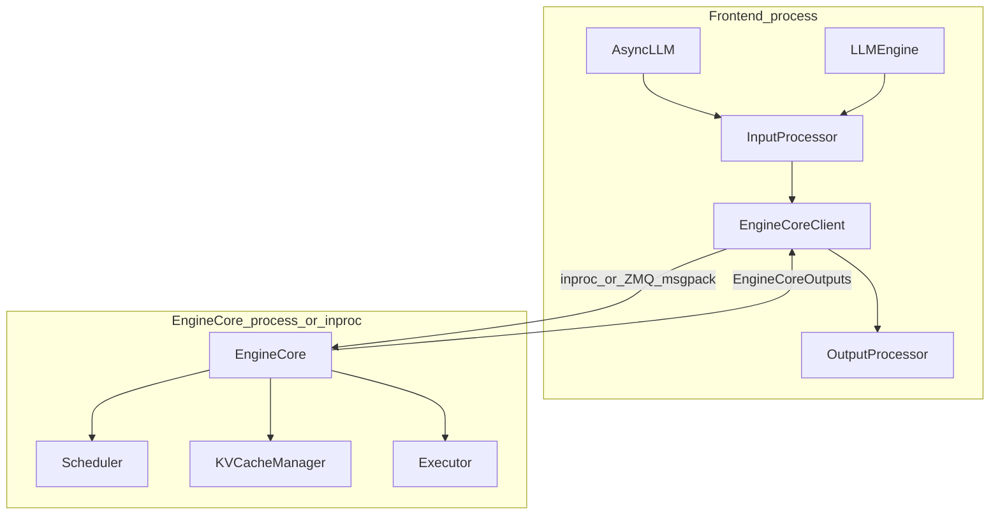

# 02 — Engine Architecture

Official companion: [docs/design/arch_overview.md](../docs/design/arch_overview.md).

## Why a multi-process design?

The GPU critical path must not wait on HTTP, JSON, HuggingFace tokenizers, or multimodal
decoding. V1 splits work:

| Process | Owns | Must stay fast? |
|---------|------|-----------------|
| API server | HTTP, tokenize, detokenize, stream | Throughput of admissions / streams |
| EngineCore | Schedule, KV accounting, dispatch | **Yes — busy loop** |
| GPU worker(s) | Weights, forward, sample, KV tensors | **Yes — GPU occupancy** |

For a typical `vllm serve -tp=4`: 1 API + 1 EngineCore + 4 workers ≈ 6 processes.
Ignore DP coordinator until you study distributed serving ([maps/ignore-list.md](maps/ignore-list.md)).

Standalone diagram: [diagrams/overview.mmd.md](diagrams/overview.mmd.md).

## Frontends vs EngineCore



### `EngineCoreClient` modes

Defined around [`vllm/v1/engine/core_client.py`](../vllm/v1/engine/core_client.py):

- **In-process** — same process as the frontend (common for offline `LLM`)
- **Sync multiprocessing** — blocking client to `EngineCoreProc`
- **Async multiprocessing** — `asyncio`-friendly client; online default

Wire format: msgspec/msgpack over ZMQ for MP paths. When debugging “request never
runs,” check whether the client enqueued successfully *and* whether EngineCore's input
queue is being drained.

### `EngineCore` — the inner loop

[`vllm/v1/engine/core.py`](../vllm/v1/engine/core.py) docstring: *“Inner loop of vLLM's Engine.”*

Simplified `step()`:

```text
scheduler_output = scheduler.schedule(...)
future = model_executor.execute_model(scheduler_output, non_block=True)
model_output = future.result()
  # may be None → sample_tokens(...)  (async scheduling split)
engine_core_outputs = scheduler.update_from_output(scheduler_output, model_output)
```

There is also `step_with_batch_queue` for overlapping CPU schedule/prep with in-flight GPU
work—same contract, more concurrency. Learn the simple `step()` first.

### `EngineCoreProc`

Background process that busy-loops: pull inputs → `step` → push outputs. This is what
keeps the GPU fed while the API process talks to clients.

## Initialization: sizing the KV cache

Before serving, `EngineCore._initialize_kv_caches`:

1. Collect per-layer `KVCacheSpec` from the executor/model
2. **Profile** available GPU memory (`determine_available_memory`)
3. Build `KVCacheConfig` / block counts (`get_kv_cache_configs`)
4. Initialize workers' KV tensors; give the scheduler its block pool view

This is why startup takes time and why `gpu_memory_utilization` and CUDA graph memory
trade directly against concurrency. See [diagrams/memory-hierarchy.mmd.md](diagrams/memory-hierarchy.mmd.md).

## Config plumbing: `VllmConfig`

Deep hierarchy (engine → executor → worker → runner → model) all take **`VllmConfig`**.
Rationale from arch_overview: add a feature touching only the runner without rewiring
every constructor. When hunting a flag, search `VllmConfig` / `vllm/config/` first.

## Class hierarchy (contributor view)

```text
AsyncLLM / LLMEngine
  └─ EngineCoreClient
       └─ EngineCore
            ├─ Scheduler ── KVCacheManager ── BlockPool
            └─ Executor
                 └─ GPUWorker
                      └─ GPUModelRunner
                           └─ model (nn.Module)
                                └─ Attention → backend impl
```

## What to ignore for now

- Data-parallel coordinator (`vllm/v1/engine/coordinator.py`)
- Ray executor variants
- Pipeline-parallel scheduling nuances
- Elastic EP / expert-parallel scale-up paths in `core.py`

## Performance considerations

- **CPU cores matter.** Tokenization threads + EngineCore + workers contend; see
  optimization docs on CPU sizing for GPU deployments.
- **Async scheduling** overlaps step N+1 prep with step N GPU—great for throughput;
  harder to reason about in debuggers (futures, deferred sampling).
- **Inproc vs MP:** inproc is easier to debug; MP matches production serving.

## Exercises

1. Set a breakpoint in `EngineCore.step` under offline `LLM` (inproc) and inspect
   `scheduler_output.num_scheduled_tokens`.
2. Compare process list for `LLM(...)` vs `vllm serve` with `tp=2`.

Next: [03-scheduler-continuous-batching.md](03-scheduler-continuous-batching.md).
