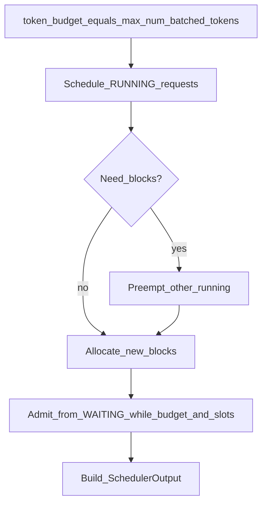

# 03 — Scheduler & Continuous Batching

Primary code: [`vllm/v1/core/sched/scheduler.py`](../vllm/v1/core/sched/scheduler.py),
[`vllm/v1/core/sched/output.py`](../vllm/v1/core/sched/output.py),
[`vllm/v1/core/sched/interface.py`](../vllm/v1/core/sched/interface.py).

Companion trace: [traces/one-engine-step.md](traces/one-engine-step.md).

## Why this abstraction exists

GPUs hate idle SMs and tiny decode batches. Continuous batching keeps the device fed by
**reforming the batch every step**: new requests enter, finished ones leave, long
prefills are chunked so they do not monopolize the step.

The scheduler is the policy brain. It does **not** run matmuls. It decides *who gets
how many tokens* and *which KV blocks they own*, then emits a `SchedulerOutput` for the
worker.

## V1's unifying idea

From the docstring comment on `Scheduler.schedule`:

> There's no "decoding phase" nor "prefill phase" in the scheduler. Each request just
> has `num_computed_tokens` and `num_tokens_with_spec`. … assign tokens so computed can
> catch up. This covers chunked prefills, prefix caching, speculative decoding, …

So:

```text
tokens_still_needed ≈ num_tokens_with_spec - num_computed_tokens
schedule min(tokens_still_needed, remaining_budget, …) for each request
```

**Chunked prefill** is not a special mode bolted on—it is “schedule fewer tokens than
the full prompt this step.”

## Queues and state

| Structure | Role |
|-----------|------|
| `waiting` | Admitted by API, not yet running (or re-queued) |
| `skipped_waiting` | Temporarily skipped (async deps / constraints) |
| `running` | Actively holding KV and eligible to schedule |

Request status lives on `Request` (`vllm/v1/request.py`). Preempted requests free KV and
typically return toward waiting with recomputation (details depend on path—read the
preempt helpers when you need them).

## One `schedule()` pass (mental algorithm)



Approximate priority:

1. Keep **running** requests progressing (decode + ongoing prefill chunks)
2. **Preempt** if allocation fails (policy picks a victim—often longest/lowest priority)
3. **Admit** waiting requests into running when `max_num_seqs` and KV allow

Always constrained by:

- `max_num_batched_tokens` — sum of scheduled tokens this step
- `max_num_seqs` — concurrent running requests
- Free KV blocks via `KVCacheManager`
- Encoder budgets if multimodal (ignore initially)

## `SchedulerOutput` — the contract with the worker

Important fields ([`output.py`](../vllm/v1/core/sched/output.py)):

| Field | Meaning |
|-------|---------|
| `num_scheduled_tokens: dict[str, int]` | Per-request tokens this step |
| `total_num_scheduled_tokens` | Sum — actual batch token count |
| `scheduled_new_reqs` / `NewRequestData` | First-time (or resume) payload: prompt tokens, block IDs, sampling params |
| `scheduled_cached_reqs` / `CachedRequestData` | Incremental updates for already-known requests |
| Encoder / spec / KV connector metadata | Feature overlays—skip at first |

The worker must be able to build GPU tensors from this alone (plus persistent state it
already keeps for cached requests).

## `update_from_output` — closing the loop

After the model returns `ModelRunnerOutput`:

- Append new token IDs
- Detect stop strings / EOS / length limits → finish
- Free blocks for finished requests
- Emit `EngineCoreOutput` per finished or streaming update

Scheduling without `update_from_output` would leak KV and never advance state.

## Bottlenecks this solves vs trade-offs

| Solves | Trade-off |
|--------|-----------|
| GPU idle from static batches | Complex CPU policy each step |
| Prefill monopoly (via chunking) | Higher TTFT for very long prompts vs one-shot prefill |
| KV pressure via preemption | Wasted FLOPs on recompute; latency spikes |
| Unified feature surface | Harder to reason about than phase machines |

## Knobs you will tune / mis-tune

| Knob | Too low | Too high |
|------|---------|----------|
| `max_num_batched_tokens` | Underutilized GPU | Long steps; bad latency |
| `max_num_seqs` | Low concurrency | KV thrash / preemption storms |
| Chunked prefill size (related configs) | Tiny chunks → overhead | Huge chunks → decode starvation |

## Common pitfalls

1. **Thinking in V0 phases.** Logs that say “prefill” often mean “this request still has
   prompt tokens left,” not a global engine mode.
2. **Starving decodes.** Pathological schedules that always prefer large prefills hurt
   TPOT—watch token budget sharing.
3. **Preemption storms.** Symptom of insufficient KV (`gpu_memory_utilization`, longer
   contexts, too many seqs)—not a random scheduler bug.
4. **Ignoring `skipped_waiting`.** Requests can sit there for structured output / async
   constraints; do not assume they are ignored forever.

## Exercises

1. Read `schedule()` until you find where `token_budget` decreases; relate to
   `num_scheduled_tokens`.
2. Find `_preempt` (or equivalent) and note which request is chosen as victim.
3. Dump a `SchedulerOutput` at breakpoint and explain every non-None field for a
   2-request batch.

Next: [04-kv-cache-paged-attention.md](04-kv-cache-paged-attention.md).
