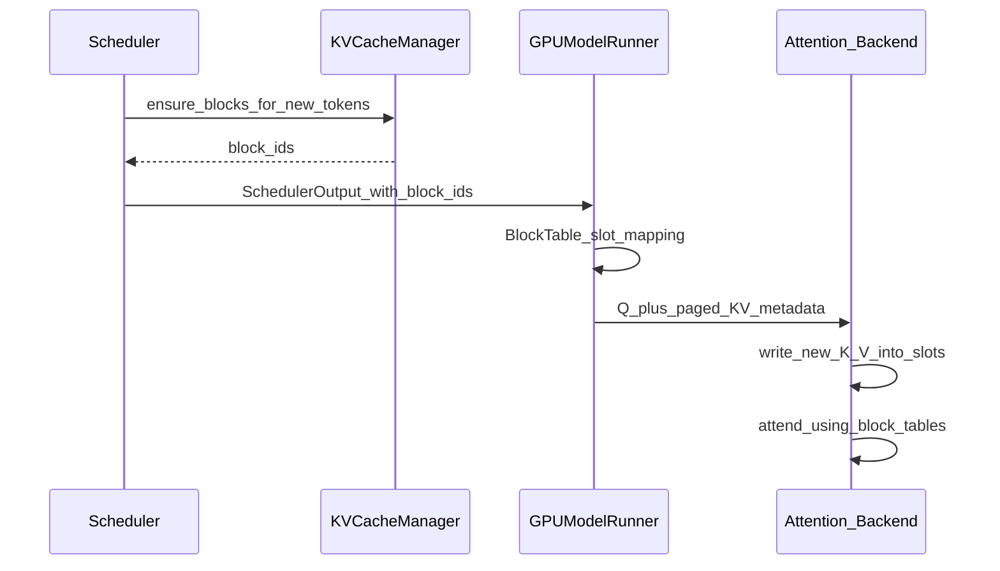

# 04 — KV Cache & Paged Attention

Diagram: [diagrams/kv-layout.mmd.md](diagrams/kv-layout.mmd.md).

Official (current): [docs/design/prefix_caching.md](../docs/design/prefix_caching.md).

Historical (do not treat as current code):
[docs/design/paged_attention.md](../docs/design/paged_attention.md).

## Why KV dominates serving

For each layer, each token produces K and V vectors that must remain available for all
future tokens in that sequence. Memory scales roughly:

```text
bytes ≈ 2 * num_layers * num_kv_heads * head_dim * sizeof(dtype) * num_tokens
```

(with GQA/MQA reducing `num_kv_heads`). On long contexts, **KV—not weights—sets
concurrency**. Fragmentation makes it worse if you allocate contiguous
`[max_seq_len, …]` per request.

## Paging: the OS analogy that actually holds

| OS virtual memory | vLLM KV |
|-------------------|---------|
| Virtual pages | Logical token blocks of `block_size` |
| Physical frames | Entries in a GPU block pool |
| Page table | Per-request **block table** |
| Page fault / alloc | `KVCacheManager` allocate |
| Sharing CoW pages | Prefix cache hits on hashed full blocks |

Attention never assumes K/V for a sequence are contiguous in HBM. Kernels take:

- **`block_tables`** — for each request, ordered physical block IDs
- **`slot_mapping`** — for each *new* token this step, which physical slot to write
- Sequence lengths / query lengths — how far to read

Worker-side helper: [`vllm/v1/worker/block_table.py`](../vllm/v1/worker/block_table.py)
(`BlockTable`, `SlotMappingMode`).

## Paged attention vs “the PagedAttention kernel”

**Concept (still central):** store KV in pages; gather at attention time.

**Implementation (evolved):** production models typically call **FlashAttention** (or
another backend) with paged KV arguments. The original hand-written paged attention CUDA
in early vLLM is not your first debugging destination.

When someone says “paged attention” in 2026 vLLM, they usually mean the **memory
system + metadata**, not a single kernel file.

## How a decode step uses the cache



Prefill (or prefill chunks) write many slots at once; decode writes one (or a few with
spec decode).

## Prefix caching (APC) — why paging enables it

If blocks are the unit of allocation, a **full block** can be content-addressed:

- Hash: parent block hash + token IDs in block + extras (LoRA, MM, salt, …)
- Lookup in `BlockHashToBlockMap` ([`block_pool.py`](../vllm/v1/core/block_pool.py))
- On hit: reuse physical block; advance `num_computed_tokens` without recomputing

Design detail worth remembering: vLLM **does not de-duplicate** identical hashes into
one block ID when allocating new cached blocks—so block tables stay **append-only**
(see notes on `BlockHashToBlockMap`). That is a deliberate trade-off (simpler tables /
fewer remaps vs more memory if duplicates exist).

Read [docs/design/prefix_caching.md](../docs/design/prefix_caching.md) after this chapter.

## What bottleneck this solves

| Without paging | With paging |
|----------------|-------------|
| Internal fragmentation to `max_len` | Pay for used blocks (+ partial last block) |
| Hard to share prefixes | Share immutable full blocks |
| Impossible to grow sequences without copy | Append blocks as tokens arrive |

**Costs:** indirection in kernels; metadata CPU work; careful lifetime / refcount for
shared blocks; eviction policy interacts with APC.

## Hybrid / sliding-window / Mamba (awareness only)

Some models need multiple KV “groups” (full attention + sliding window, or Mamba state).
[`KVCacheCoordinator`](../vllm/v1/core/kv_cache_coordinator.py) and
[docs/design/hybrid_kv_cache_manager.md](../docs/design/hybrid_kv_cache_manager.md)
cover this. For onboarding: know the facade (`KVCacheManager` returns
`KVCacheBlocks` per group) and defer deep hybrid logic.

## Exercises

1. For `block_size=16`, how many blocks does a 100-token prompt need? Where does the
   partial block live?
2. Explain why a prefix cache hit can reduce TTFT without changing model weights.
3. In `BlockTable`, read how `slot_mapping` is computed from block IDs + positions.

Next: [05-block-manager-memory.md](05-block-manager-memory.md).
