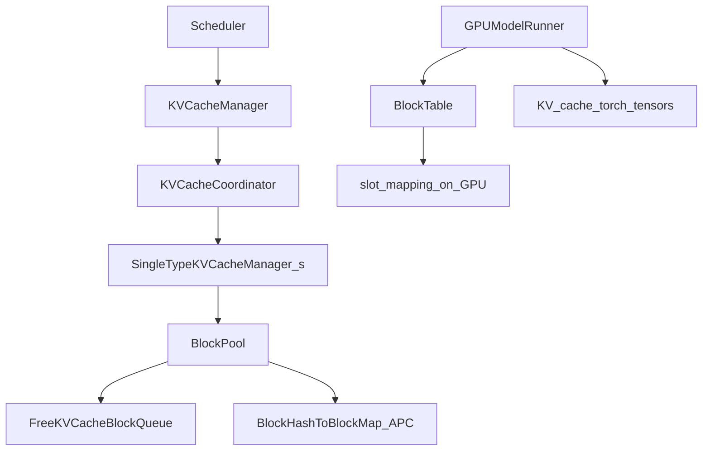

# 05 — Block Manager & Memory Management

Diagram: [diagrams/memory-hierarchy.mmd.md](diagrams/memory-hierarchy.mmd.md).

## Layered responsibilities



| Component | File | Job |
|-----------|------|-----|
| `KVCacheManager` | [`vllm/v1/core/kv_cache_manager.py`](../vllm/v1/core/kv_cache_manager.py) | Facade for scheduler; returns `KVCacheBlocks` |
| `BlockPool` | [`vllm/v1/core/block_pool.py`](../vllm/v1/core/block_pool.py) | Free list + prefix hash map |
| `KVCacheBlock` | [`vllm/v1/core/kv_cache_utils.py`](../vllm/v1/core/kv_cache_utils.py) | Metadata for one block ID |
| `KVCacheSpec` / `KVCacheConfig` | [`vllm/v1/kv_cache_interface.py`](../vllm/v1/kv_cache_interface.py) | Shapes, page size, groups |
| `BlockTable` | [`vllm/v1/worker/block_table.py`](../vllm/v1/worker/block_table.py) | GPU-facing tables / slot mapping |

The scheduler should not poke pool internals—that is why `KVCacheBlocks` exists.

## GPU memory at init (who wins HBM)

Rough leftover after profiling:

```text
KV_bytes ≈ available_after_profile * f(gpu_memory_utilization)
num_blocks ≈ KV_bytes / bytes_per_block
```

`EngineCore._initialize_kv_caches` profiles, then
`get_kv_cache_configs` / `generate_scheduler_kv_cache_config` publish
`num_gpu_blocks` into cache config. **Concurrency ceiling** ≈ how many sequences of
your target length fit in those blocks (see logged KV capacity metrics).

Trade-offs:

| Increase `gpu_memory_utilization` | Decrease it |
|-----------------------------------|-------------|
| More blocks, fewer preemptions | Safer headroom for graphs / fragmentation |
| Higher OOM risk at capture/runtime | Lower max concurrency |

CUDA graph capture memory is a common surprise—see
[docs/design/cuda_graphs.md](../docs/design/cuda_graphs.md) and
[docs/configuration/optimization.md](../docs/configuration/optimization.md).

## Physical layout (conceptual)

Per attention layer (simplified):

```text
KV cache tensor ≈ [num_blocks, block_size, num_kv_heads, head_dim]  # for K and V
# exact layout depends on backend / dtype / page size; read KVCacheSpec
```

A request with block table `[7, 2, 19]` stores tokens:

- tokens `[0, block_size)` → physical block 7
- next page → block 2
- …

**Never confuse:**

| Term | Means |
|------|-------|
| `block_id` | Index into the pool / table entry |
| Position in sequence | Token index `0..len-1` |
| Slot | Physical cell where one token's K/V lives (`block_id * block_size + offset`) |

`slot_mapping[i]` for a newly scheduled token tells the cache-update kernel where to
scatter K/V.

## Allocate / free / prefix hit

Typical scheduler interactions:

1. **New request:** find prefix hits → set `num_computed_tokens` → allocate blocks for
   the remainder
2. **Running request growing:** allocate additional blocks when crossing boundaries
3. **Finish / abort / preempt:** decrement refs; return blocks to free queue; APC may
   keep hashed blocks reusable until evicted

Refcounting matters: a block shared by two requests cannot be freed when one finishes.

## Block size trade-offs

| Smaller blocks | Larger blocks |
|----------------|---------------|
| Less internal waste on partial pages | Smaller page tables / fewer IDs |
| More metadata & kernel overhead | More waste in the last partial block |
| Finer-grained APC sharing | Coarser sharing granularity |

`block_size` must be compatible with the attention backend's kernel page size (see
`BlockTable`'s hybrid block splitting when they differ).

## Performance & pitfalls

1. **OOM at startup** — profile + graphs + weights exceed device; lower utilization or
   graph mode.
2. **OOM at runtime** — rarer if profiled correctly; watch concurrent features.
3. **Thrashing** — `num_blocks` too small for `max_num_seqs` × context → preemption.
4. **APC silent wrongness** — incorrect hash extras (LoRA/MM) could theoretically serve
   wrong KV; treat hash composition as safety-critical when extending.
5. **Assuming contiguous `block_id` sequences** — IDs are pool indices, not positions.

## Debugging tips

- Log free block count over time alongside running request count.
- On preemption warnings, compute rough need:
  `num_seqs * cdiv(seq_len, block_size) * num_layers_groups` vs `num_gpu_blocks`.
- For a single request, print block table and verify `len(blocks) == cdiv(seq_len, block_size)`
  (modulo prefix hits / sliding window quirks).

## Exercises

1. Read `KVCacheBlocks.get_block_ids` and trace where the scheduler puts those IDs into
   `NewRequestData`.
2. In `BlockPool`, find free-queue pop/push paths.
3. Estimate blocks for Llama-3 8B, 8k context, 32 concurrent seqs—then compare to what
   your GPU reports at startup.

Next: [06-model-execution-pipeline.md](06-model-execution-pipeline.md).
