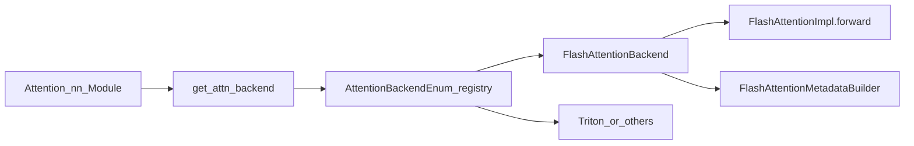

# 07 — Attention Backends

Official matrix: [docs/design/attention_backends.md](../docs/design/attention_backends.md).

Primary code:

- [`vllm/model_executor/layers/attention/attention.py`](../vllm/model_executor/layers/attention/attention.py) — `Attention` module
- [`vllm/v1/attention/selector.py`](../vllm/v1/attention/selector.py) — `get_attn_backend`
- [`vllm/v1/attention/backends/registry.py`](../vllm/v1/attention/backends/registry.py)
- [`vllm/v1/attention/backends/flash_attn.py`](../vllm/v1/attention/backends/flash_attn.py) — **start here**
- [`vllm/v1/attention/backend.py`](../vllm/v1/attention/backend.py) — abstract interfaces

## Why backends are pluggable

Attention is the hottest, most hardware-sensitive op. Requirements differ by:

- GPU generation / vendor
- Head dim, dtype, KV dtype (FP8, …)
- Sliding window, ALiBi, sinks, MLA, encoder-only, …
- Block size / paged layout support

Models should call one `Attention` module. **Backends** encapsulate kernel choice and
metadata builders. That keeps `llama.py`-style model code readable.

## Selection flow

`get_attn_backend(...)` considers head size, dtype, KV cache dtype, block size, MLA
flags, sinks, platform, env overrides, etc. Priority and feature coverage are documented
in the design doc—do not memorize every branch; learn *where* the decision happens.

## What a backend must provide

Conceptually (see `AttentionBackend` / `AttentionImpl`):

1. **Metadata builder** — from runner batch state → backend-specific `AttentionMetadata`
2. **Forward impl** — Q, K, V (+ KV cache) → attention output
3. **KV cache update** — scatter new K/V into paged slots (sometimes fused)
4. **Capability flags** — what features it supports so the selector can reject mismatches

## FlashAttention path (your default study target)

File: `vllm/v1/attention/backends/flash_attn.py`

Pieces:

| Class | Role |
|-------|------|
| `FlashAttentionBackend` | Registration / name `"FLASH_ATTN"` |
| `FlashAttentionMetadata` | Seqlens, block tables, etc. |
| `FlashAttentionMetadataBuilder` | Builds metadata each step |
| `FlashAttentionImpl` | `forward(...)` calling into FA kernels |

Study order: metadata fields → how builder fills them from the model runner → `forward`
up to the actual FA call. Ignore DCP/MLA branches on first pass.

## Triton and others

Triton ops under [`vllm/v1/attention/ops/`](../vllm/v1/attention/ops/) are excellent for
**reading algorithms** (reshape-and-cache, unified attention) when CUDA C++ is opaque.
They may be fallbacks or specialized paths—not always the production default.

**Ignore initially:** MLA backends, ROCm AITER, XPU, TPU, CPU, Flex, TurboQuant, Mamba
state caches—see [maps/ignore-list.md](maps/ignore-list.md).

## Trade-offs

| Choice | Pros | Cons |
|--------|------|------|
| FlashAttention | Best perf on NVIDIA for common shapes | Version/feature constraints |
| Triton | Hackable, portable-ish | Often slower; more Python overhead |
| Multiple backends | Hardware coverage | Selector complexity; testing matrix |

## Common pitfalls

1. Forcing a backend via env that does not support your `block_size` / dtype.
2. Debugging FA issues by reading the historical `paged_attention.md` kernel walkthrough.
3. Assuming metadata from step N is still valid in step N+1.

## Exercises

1. Log which backend is selected at startup (vLLM usually logs it once).
2. In `FlashAttentionMetadata`, list five fields and guess which runner code fills them.
3. Find `reshape_and_cache` / store path used with FA (CUDA or Triton).

Next: [08-kernels-cuda-triton.md](08-kernels-cuda-triton.md).
