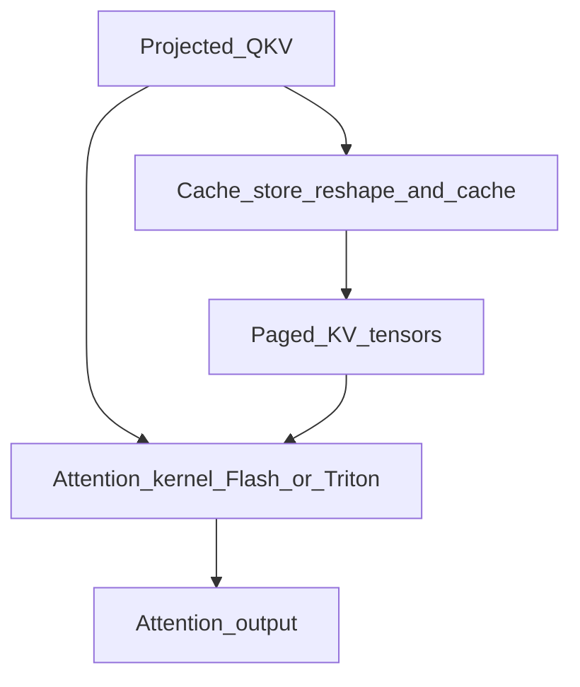

# 08 — CUDA & Triton Kernels (Moderate Depth)

This chapter is **not** a CUDA programming course. It teaches enough layout and call
structure to profile, read ops, and know when to escalate to kernel experts.

## Where kernels live

| Location | Contents |
|----------|----------|
| [`csrc/`](../csrc/) | CUDA extensions; `torch_bindings.cpp` entry |
| [`csrc/libtorch_stable/`](../csrc/libtorch_stable/) | Modern ops (cache, attention helpers, MoE, quant, …) |
| [`csrc/attention/`](../csrc/attention/) | Older attention-related CUDA (historical gravity) |
| [`vllm/_custom_ops.py`](../vllm/_custom_ops.py) | Python bindings to C++/CUDA ops |
| [`vllm/v1/attention/ops/`](../vllm/v1/attention/ops/) | Triton implementations |

Models almost never call `csrc` directly—they go through layers → backends → ops.

## Two jobs attention-related kernels do



1. **Cache update** — write new K/V into paged slots (`slot_mapping`)
2. **Attention** — read Q and paged K/V (`block_tables`, seqlens) → output

Fusions (RoPE+cache, etc.) exist; treat them as optimizations after you understand the
unfused mental model. See [docs/design/fusions.md](../docs/design/fusions.md) later.

## Tensor / memory layouts you must know

### Q (query) for this step

Typically packed as a contiguous batch of tokens scheduled this step:

```text
Q: [num_tokens, num_heads, head_dim]
```

(exact strides may vary; runners pack carefully for graphs).

### Paged K/V

Conceptual:

```text
K_cache: [num_blocks, block_size, num_kv_heads, head_dim]
V_cache: [num_blocks, block_size, num_kv_heads, head_dim]
```

Backend-specific layouts (e.g. FA-oriented) may permute dimensions—always confirm in the
backend or `KVCacheSpec` when optimizing.

### `block_tables`

```text
block_tables: [max_num_reqs, max_blocks_per_req]  # physical block ids
```

### `slot_mapping`

```text
slot_mapping: [num_tokens]  # physical slot for each new token this step
# often: block_id * block_size + offset_in_block
# PAD_SLOT_ID for padding tokens
```

Defined/used via [`BlockTable`](../vllm/v1/worker/block_table.py).

## Path A — FlashAttention (production default on NVIDIA)

Study file: [`flash_attn.py`](../vllm/v1/attention/backends/flash_attn.py)
`FlashAttentionImpl.forward`.

What to extract on first read (ignore MLA/DCP):

1. Where KV cache is passed in
2. Where metadata supplies block tables / seqlens
3. The call into flash-attn (varlen / KV-cache APIs depending on version)
4. Any explicit cache-store call if not fused inside

You are verifying: **paged metadata → FA**, not reinventing FA math.

## Path B — One Triton op (readable teaching tool)

Open [`triton_reshape_and_cache_flash.py`](../vllm/v1/attention/ops/triton_reshape_and_cache_flash.py)
and/or [`triton_unified_attention.py`](../vllm/v1/attention/ops/triton_unified_attention.py).

Read for:

- How `slot_mapping` indexes stores
- How block IDs translate to pointers
- Boundaries between Python wrapper and `@triton.jit` kernel

Triton is often slower than FA but **human-readable**. Use it to solidify layouts, then
trust FA in production profiles.

## CUDA graphs vs kernels

Graphs replay a sequence of kernel launches; they do not change paging math. When a
graph is captured for a shape, padded tokens and `PAD_SLOT_ID` must behave correctly—a
common source of subtle bugs when extending metadata.

## Performance considerations

| Topic | Why it matters |
|-------|----------------|
| Memory-bound decode | KV loads dominate; batching + paging efficiency matter |
| Prefill | More compute-bound; chunk size changes arithmetic intensity |
| Launch overhead | Many small kernels → graphs / fusion |
| Dtype | FP8 KV saves memory/bandwidth with accuracy trade-offs |

## What you can safely ignore

- Writing new CUDA from scratch on day one
- Historical paper kernel walkthrough as if it were today's FA path
- Vendor-specific backends (ROCm, XPU, …) until you work on that hardware

## Exercises

1. From a PyTorch profile, name the top three GPU ops during decode of a tiny model.
2. Manually compute `slot_mapping` for tokens at positions 0,15,16 with `block_size=16`
   and block table `[4, 9]`.
3. Grep `_custom_ops` for `reshape_and_cache` and note which Python callers use it.

Next: [09-sampling-output-path.md](09-sampling-output-path.md).
