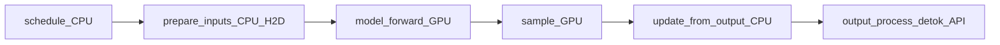

# 10 — Performance & Profiling

Official how-to: [docs/contributing/profiling.md](../docs/contributing/profiling.md).

Tuning knobs overview: [docs/configuration/optimization.md](../docs/configuration/optimization.md).

## What to measure (serving mental model)

| Metric | Meaning | If bad, suspect |
|--------|---------|-----------------|
| **TTFT** | Time to first token | Queueing, long prefill, tokenization, cold start |
| **TPOT / ITL** | Time per output token | Decode batch too small, graphs off, CPU overhead |
| **Throughput** | Tokens/s or req/s | Overall capacity; KV limits; schedule efficiency |
| **KV utilization** | Used blocks / total | Too low → under-admitting; too high → preemptions |
| **Preemption rate** | Preempts over time | Insufficient KV for concurrency/context |
| **Schedule time** | CPU in `schedule()` | Pathological queues, Python overhead |

Never optimize a kernel when TTFT is dominated by a 10k-deep waiting queue.

## Where time goes in one step



Async scheduling aims to hide `S`/`P` of step N+1 behind `F` of step N. Profiles should
be read with that overlap in mind—serial flame graphs can mislead.

## Tooling choices

| Tool | Use |
|------|-----|
| **Nsight Systems** | Low-overhead timeline; GPU/CPU gaps |
| **PyTorch Profiler** | Ops, shapes, stacks; higher overhead |
| `vllm bench serve` / `vllm bench` | End-to-end latency throughput |
| Engine metrics / Prometheus | Online KV, running/waiting counts |

From contributing docs: end users should not leave profiling on—it heavily slows inference.
Developers: profile few requests; traces get large.

Example pattern (see official doc for flags):

```bash
vllm serve <model> --profiler-config '{"profiler": "torch", "torch_profiler_dir": "./vllm_profile"}'
```

Offline example under `examples/features/profiling/`.

## Hypothesize before you dig

| Observation | First hypothesis |
|-------------|------------------|
| GPU idle gaps between steps | CPU schedule/prep or sync points |
| GPU busy but low tokens/s | Memory-bound decode; raise batch; check KV |
| Prefill OK, decode slow | Graphs, batch size during decode, sampling cost |
| Random latency spikes | Preemption, GC, APC churn, noisy neighbor |
| Startup OOM | Graphs + KV + weights; lower utilization / graph mode |

## Useful places to add temporary timers

- `EngineCore.step` around `schedule`, `execute_model`, `update_from_output`
- `GPUModelRunner.execute_model` preprocess vs forward
- Do **not** leave debug timers in PRs without a metrics framework

## Config levers tied to this guide

| Lever | Chapter context |
|-------|-----------------|
| `max_num_batched_tokens` | Scheduler budget |
| `max_num_seqs` | Concurrency vs KV |
| `gpu_memory_utilization` | Block pool size |
| `enable_prefix_caching` | APC hit rate vs overhead |
| CUDA graph mode | Decode launch overhead vs memory |
| `--kv-cache-memory` | Skip profile (dangerous if machine changes) |

## Exercises

1. Run a tiny offline generate with PyTorch profiler; identify top CUDA op in decode.
2. Saturate the server until preemptions appear; correlate with KV metrics.
3. Compare TPOT with graphs enabled vs forced eager on the same workload.

Next: [11-debugging-pitfalls.md](11-debugging-pitfalls.md).
