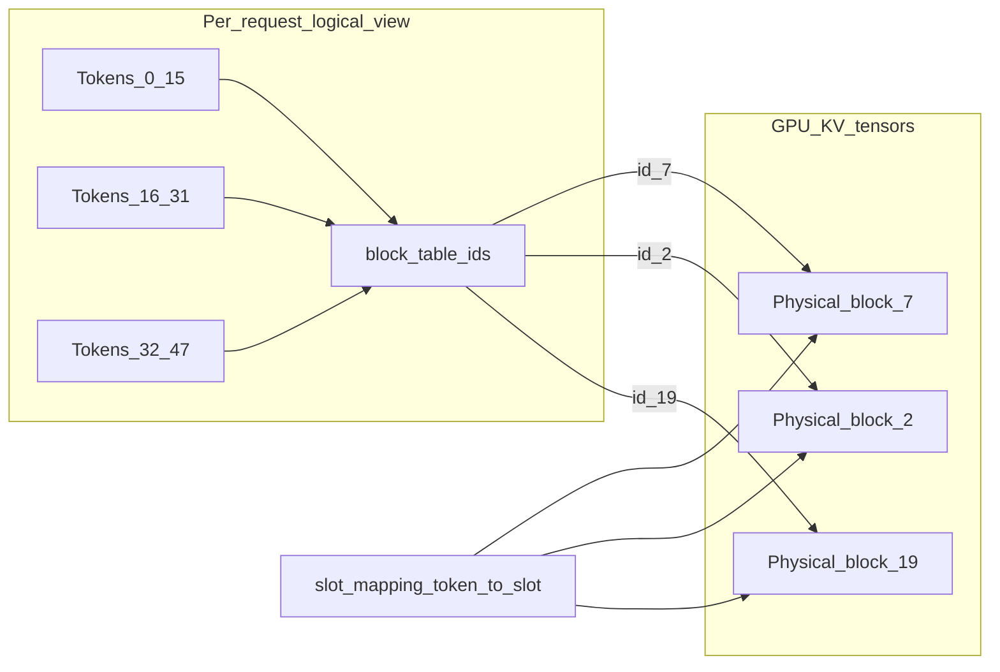

# Diagram: logical blocks → physical KV

**Invariant:** block IDs in the table are *logical handles* into a pool; they need not be
contiguous. Attention kernels index K/V through `block_tables` + `slot_mapping`, not
through a contiguous `[seq, pos]` tensor.

Use with: [04-kv-cache-paged-attention.md](../04-kv-cache-paged-attention.md),
[05-block-manager-memory.md](../05-block-manager-memory.md).
