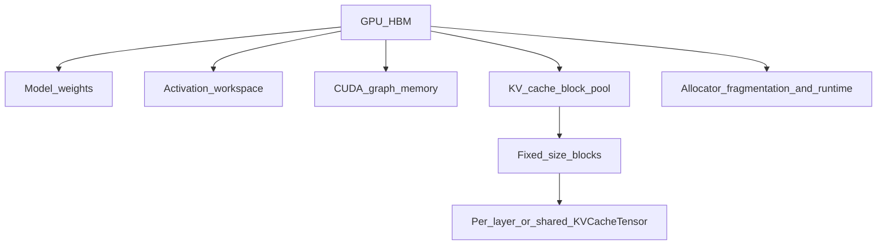

# Diagram: GPU memory hierarchy at init

**Init order that matters:**

1. Load / shard weights
2. Profile peak activation (+ graph capture estimates)
3. Give the remainder (scaled by `gpu_memory_utilization`) to the KV block pool
4. Scheduler concurrency is then bounded by `num_gpu_blocks`

Use with: [05-block-manager-memory.md](../05-block-manager-memory.md),
[02-engine-architecture.md](../02-engine-architecture.md).
