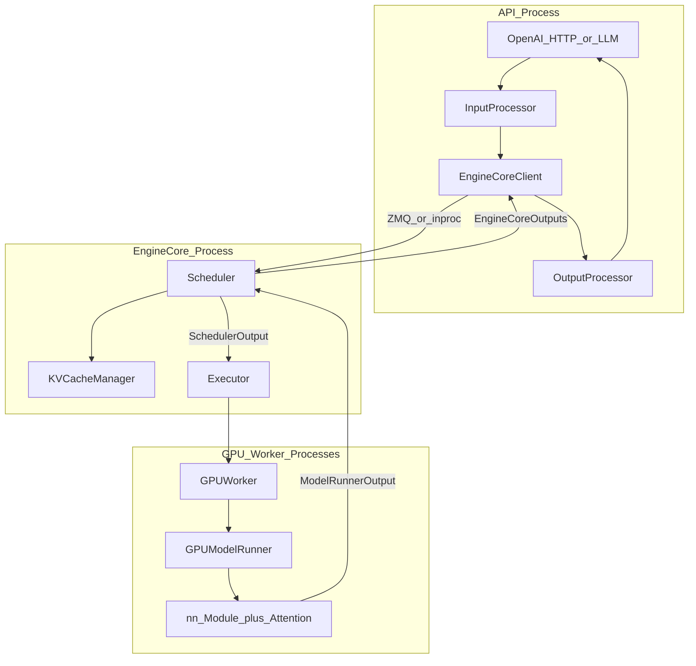

# Diagram: V1 process overview

```mermaid
flowchart TB
  subgraph api [API_Process]
    HTTP[OpenAI_HTTP_or_LLM]
    IP[InputProcessor]
    OP[OutputProcessor]
    Client[EngineCoreClient]
  end

  subgraph core [EngineCore_Process]
    Sched[Scheduler]
    KV[KVCacheManager]
    Exec[Executor]
  end

  subgraph gpu [GPU_Worker_Processes]
    Worker[GPUWorker]
    Runner[GPUModelRunner]
    Model[nn_Module_plus_Attention]
  end

  HTTP --> IP --> Client
  Client -->|"ZMQ_or_inproc"| Sched
  Sched --> KV
  Sched -->|"SchedulerOutput"| Exec
  Exec --> Worker --> Runner --> Model
  Model -->|"ModelRunnerOutput"| Sched
  Sched -->|"EngineCoreOutputs"| Client
  Client --> OP --> HTTP
```

Use with: [02-engine-architecture.md](../02-engine-architecture.md),
[docs/design/arch_overview.md](../../docs/design/arch_overview.md).
