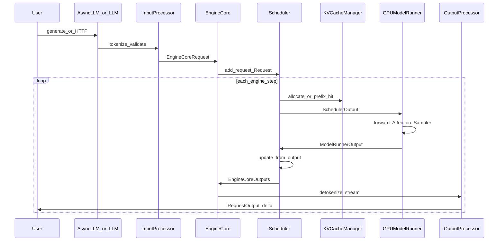

# Diagram: request flow API → tokens

```mermaid
sequenceDiagram
  participant User
  participant Frontend as AsyncLLM_or_LLM
  participant InProc as InputProcessor
  participant Core as EngineCore
  participant Sched as Scheduler
  participant KV as KVCacheManager
  participant Runner as GPUModelRunner
  participant OutProc as OutputProcessor

  User->>Frontend: generate_or_HTTP
  Frontend->>InProc: tokenize_validate
  InProc->>Core: EngineCoreRequest
  Core->>Sched: add_request_Request
  loop each_engine_step
    Sched->>KV: allocate_or_prefix_hit
    Sched->>Runner: SchedulerOutput
    Runner->>Runner: forward_Attention_Sampler
    Runner->>Sched: ModelRunnerOutput
    Sched->>Sched: update_from_output
    Sched->>Core: EngineCoreOutputs
    Core->>OutProc: detokenize_stream
    OutProc->>User: RequestOutput_delta
  end
```

Use with: [01-request-lifecycle.md](../01-request-lifecycle.md),
[traces/](../traces/).
