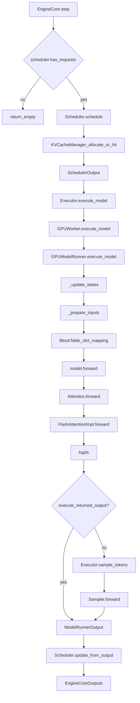

# One-Step Call Graph

Canonical happy path for `EngineCore.step` (simplified; async batch-queue variant omitted).

## Symbol → file cheat sheet

| Symbol | File |
|--------|------|
| `EngineCore.step` | `vllm/v1/engine/core.py` |
| `Scheduler.schedule` | `vllm/v1/core/sched/scheduler.py` |
| `KVCacheManager` | `vllm/v1/core/kv_cache_manager.py` |
| `SchedulerOutput` | `vllm/v1/core/sched/output.py` |
| `GPUModelRunner.execute_model` | `vllm/v1/worker/gpu_model_runner.py` |
| `BlockTable` | `vllm/v1/worker/block_table.py` |
| `Attention` | `vllm/model_executor/layers/attention/attention.py` |
| `FlashAttentionImpl` | `vllm/v1/attention/backends/flash_attn.py` |
| `Sampler` | `vllm/v1/sample/sampler.py` |
| `update_from_output` | `vllm/v1/core/sched/scheduler.py` |

## How to use this

1. Pick a bug or profile hotspot
2. Find the nearest node above
3. Open only that file + its immediate callee
4. Resist jumping into ignored areas ([ignore-list.md](ignore-list.md))

Companion narrative: [../traces/one-engine-step.md](../traces/one-engine-step.md).
