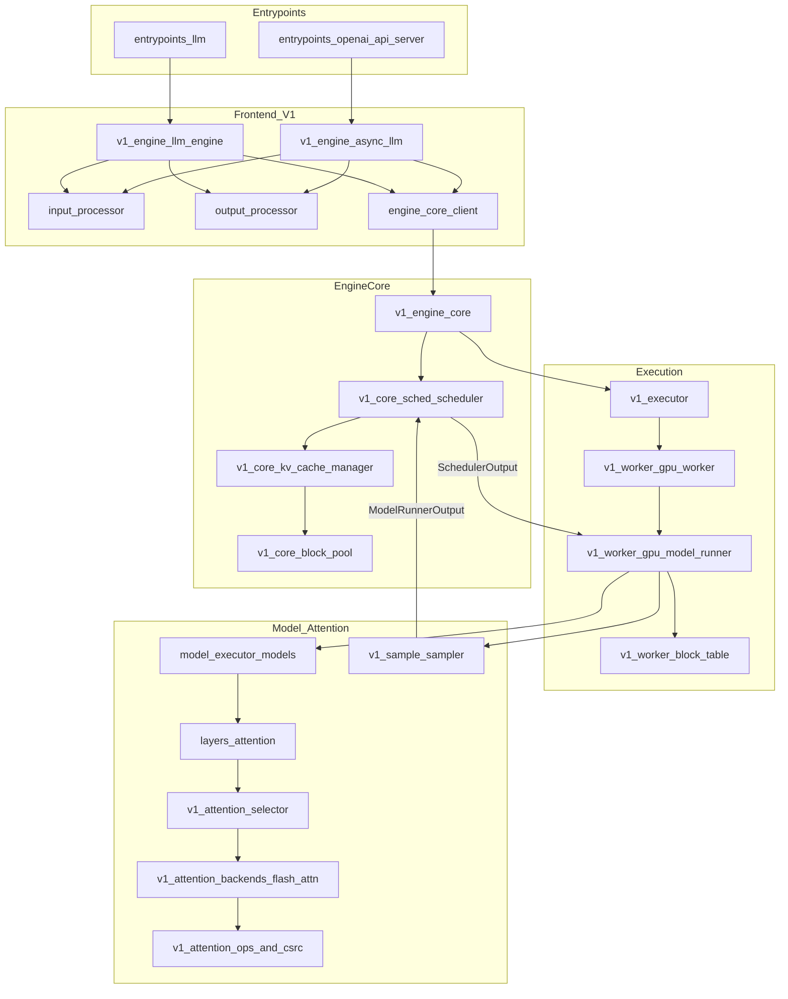

# Module Dependency Map

High-level dependencies for the fast-inference core. Arrows mean “uses / calls.”

## Notes

- Config (`vllm/config`) fans into almost every node—omitted to reduce clutter.
- Multimodal, spec decode, and distributed KV would hang off scheduler/runner/executor;
  deliberately omitted ([ignore-list.md](ignore-list.md)).

See also [call-graph.md](call-graph.md) for the per-step call sequence.
