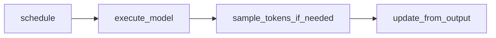

# Trace: One `EngineCore.step`

**Goal:** Internalize the schedule → execute → sample → update contract. This is the
heartbeat of vLLM.

Primary code: [`EngineCore.step`](../vllm/v1/engine/core.py) in `vllm/v1/engine/core.py`.

## The four beats

### 1. `scheduler.schedule()` → `SchedulerOutput`

File: [`vllm/v1/core/sched/scheduler.py`](../vllm/v1/core/sched/scheduler.py)

- Walk **running** requests; assign tokens under `token_budget`
- Admit from **waiting** if KV and slot limits allow
- May **preempt** running requests to free blocks
- Return plan: `num_scheduled_tokens`, new/cached request data, block IDs, …

Comment in code (paraphrased): there is no separate prefill/decode phase—only
`num_computed_tokens` catching up to needed tokens.

### 2. `model_executor.execute_model(scheduler_output)`

- Executor fans out to `GPUWorker` → `GPUModelRunner.execute_model`
- Runner updates persistent batch state, builds attention metadata, runs forward
- With async scheduling, this may return `None` and defer sampling

### 3. `sample_tokens(...)` (conditional)

If execute returned `None`, EngineCore calls `sample_tokens` with optional grammar
bitmask. Sampling lives on the worker/runner side via
[`vllm/v1/sample/sampler.py`](../vllm/v1/sample/sampler.py).

### 4. `scheduler.update_from_output(scheduler_output, model_output)`

- Append sampled tokens to each `Request`
- Apply stop / length finish reasons
- Free KV blocks for finished / preempted paths
- Produce `EngineCoreOutputs` for the frontend

## Example micro-trace (two requests)

| Step | Waiting | Running | Budget use | Notes |
|------|---------|---------|------------|-------|
| t0 | A (prompt 100), B (prompt 8) | — | admit A chunk 64, admit B 8 | mixed prefill |
| t1 | — | A, B | A 36, B 1 | A finishes prefill; B decodes |
| t2 | — | A, B | A 1, B 1 | both decode |
| t3 | — | A | A 1 | B finished; blocks freed |

## What *not* to confuse

| Concept | Meaning |
|---------|---------|
| `num_scheduled_tokens[rid]` | Tokens to compute **this step** |
| `num_computed_tokens` | Tokens already reflected in KV |
| `max_num_seqs` | Cap on concurrent running requests |
| `max_num_batched_tokens` | Cap on sum of scheduled tokens per step |

## Async variant

`step_with_batch_queue` prioritizes filling a queue of in-flight batches so CPU
scheduling overlaps GPU. Same outputs eventually; different latency profile when
debugging with breakpoints.

See also [maps/call-graph.md](../maps/call-graph.md).

Next chapter after Stage 1: [03-scheduler-continuous-batching.md](../03-scheduler-continuous-batching.md).
