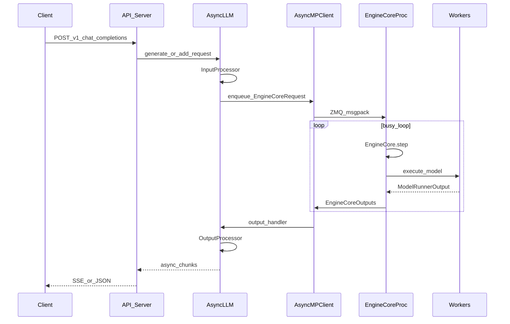

# Trace: Online OpenAI-compatible serve

**Goal:** See how HTTP requests become `AsyncLLM` work and stream back.

## Entry

```bash
vllm serve <model>
# or (deprecated style) python -m vllm.entrypoints.openai.api_server ...
```

Primary files:

- [`vllm/entrypoints/openai/api_server.py`](../vllm/entrypoints/openai/api_server.py)
- [`vllm/v1/engine/async_llm.py`](../vllm/v1/engine/async_llm.py)
- [`vllm/v1/engine/core_client.py`](../vllm/v1/engine/core_client.py)
- [`vllm/v1/engine/core.py`](../vllm/v1/engine/core.py) (`EngineCoreProc`)

## Sequence



## Mental model

- **API process:** admission control, auth/routing (serving layer), tokenization,
  streaming HTTP. Must not block on model forward.
- **EngineCore process:** only scheduler + KV + dispatch. Busy loop.
- **Workers:** GPU.

`AsyncLLM.generate` returns an async iterator; an output handler continuously pulls from
the engine client and feeds `OutputProcessor`.

## Debugging tips unique to online

1. **Hung request, GPU idle:** client enqueue vs EngineCore not stepping (pause state,
   crashed worker, ZMQ backpressure).
2. **Hung request, GPU busy:** request not scheduled (KV full, waiting queue policy,
   max_num_seqs).
3. **Slow TTFT:** long queue, heavy prefill chunking, tokenization/media loading in API
   process (ignore multimodal loaders for now, but know they live here).

## Skip for later

Multi-API-server × multi-DP topologies, router sidecars, disaggregated prefill.

Next: [one-engine-step.md](one-engine-step.md).
